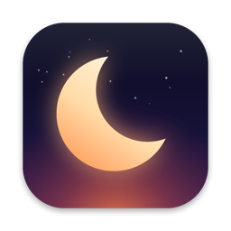
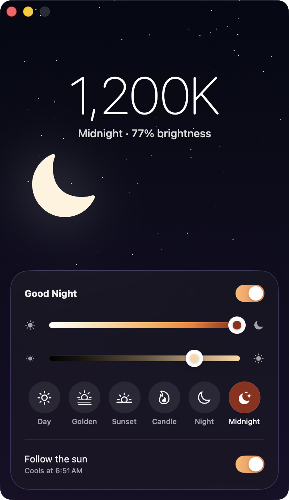
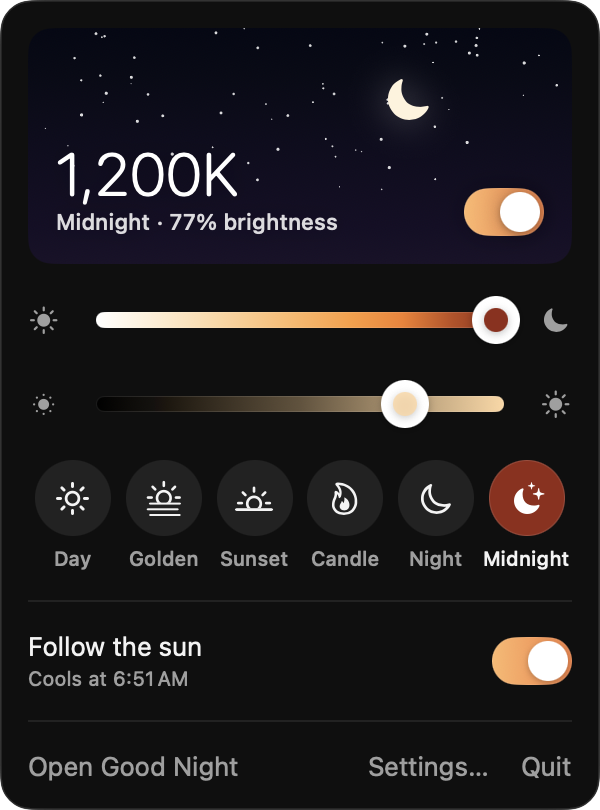
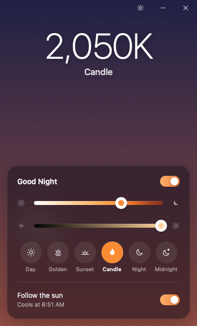
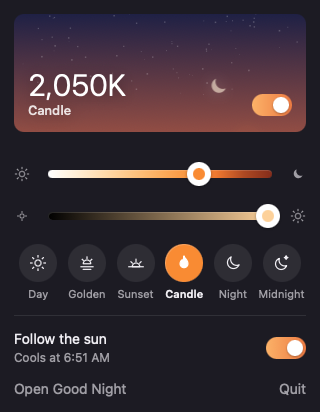

<p align="center">
  
</p>

<h1 align="center">Good Night</h1>

<p align="center">
  Warm your screen after sunset and dim it all the way to black.<br>
  A tiny, free app for macOS and Windows.
</p>

<p align="center">
  <a href="https://github.com/michael-berardi/goodnight/releases/latest">Download</a> ·
  <a href="#how-it-works">How it works</a> ·
  <a href="#build-from-source">Build from source</a>
</p>

<p align="center">
  
  &nbsp;
  
</p>

## What it does

- **Warmth.** One slider takes your screen from daylight (6,500K) to candlelight (2,000K) to deep night (1,200K). Six presets sit along the way: Day, Golden, Sunset, Candle, Night and Midnight.
- **Brightness.** A second slider dims every display in software, down to black. It works on external monitors that have no brightness control of their own.
- **Follow the sun.** Good Night warms your screen over an hour around sunset and cools it again at sunrise. Sunrise and sunset come from your time zone's city, so it never asks for your location.
- **Menu bar and Dock (tray and window on Windows).** Keep it in either place or both. Settings let you turn each one off.
- **Shortcuts that work anywhere.** Change warmth and brightness from any app, even when the screen is too dark to see.

| | macOS | Windows |
|---|---|---|
| Warmer / cooler | ⌃⌥⌘ → / ← | Ctrl Alt Shift → / ← |
| Brighter / dimmer | ⌃⌥⌘ ↑ / ↓ | Ctrl Alt Shift ↑ / ↓ |
| Presets | ⌘1 – ⌘6 | Tray flyout |
| Turn on or off | ⇧⌘T | Tray menu |

If you dim all the way to black, press brighter to come back. Good Night also never starts below 30% brightness.

## Install

**macOS 13 or later.** Download `GoodNight-<version>-mac.dmg` from [Releases](https://github.com/michael-berardi/goodnight/releases/latest), open it, and drag Good Night to Applications. The app is signed and notarized by Apple.

**Windows 10 and 11 (preview).** Download `GoodNight-<version>-windows-x64-setup.exe` from [Releases](https://github.com/michael-berardi/goodnight/releases/latest) and run it. The installer asks for administrator rights once so Windows allows the full colour range; see [Windows notes](#windows-notes). The installer is not code-signed yet, so Windows SmartScreen may ask first: choose **More info**, then **Run anyway**.

**Updates.** Good Night checks for a new version once a day and installs it when you agree. Every update is signed, and the app checks that signature before installing anything. You can turn the daily check off in Settings, or check any time from **Good Night › Check for Updates…** on macOS and **Settings › Check now** on Windows.

<p align="center">
  
  &nbsp;
  
</p>

## How it works

Every display has a small colour lookup table that the graphics hardware applies to each pixel on its way to the screen. Good Night rewrites that table and then goes back to sleep. The GPU does no extra work, nothing is layered over your windows, and screenshots and screen recordings keep their true colours.

The tint is built to keep content readable:

1. **Accurate warmth.** Each colour temperature is a real blackbody white point from the CIE Planckian locus (Krystek's 1985 formula), converted to your display's signal.
2. **Blue never goes to zero.** At the warmest settings a little blue (about 1% of its light) is kept, so blue links, icons and text stay visible instead of turning black.
3. **Highlights dim, shadows stay.** Deep night lowers bright whites the most and leaves dark tones almost untouched, so dark-mode apps and dark text keep their contrast while white pages stop glaring.
4. **Your calibration is kept.** The tint multiplies the display's existing curve instead of replacing it.
5. **Smooth changes.** Presets and schedule changes fade over one second. Sliders respond instantly.

Run `"/Applications/Good Night.app/Contents/MacOS/GoodNight" --probe` to print the exact curve and today's sunrise and sunset for your time zone.

### What it costs

On an Apple silicon Mac, the app is 4.5 MB, 3 MB of which is the Sparkle updater. When idle it uses 0% CPU and about 40 MB of memory, most of which is the system's SwiftUI libraries. It wakes once a minute while following the sun. The Windows installer is 2 MB, and closing its windows frees their web views.

### Privacy

Good Night has no account and collects nothing. Its only network request is the daily update check, which downloads a small file from GitHub Releases. Settings stay on your computer.

## Windows notes

- Windows limits how far an app may change the colour table. The installer sets `GdiIcmGammaRange` to 256 under `HKLM\SOFTWARE\Microsoft\Windows NT\CurrentVersion\ICM`, the same setting f.lux uses, so deep warmth and dimming work. If Windows still refuses, Good Night says so in its window.
- Windows keeps a colour table after an app exits, so Good Night restores your displays when it quits.
- The Windows build is a preview. It shares the macOS engine and passes its tests, and reports from real hardware are welcome in [Issues](https://github.com/michael-berardi/goodnight/issues).

## Build from source

**macOS** (Xcode 26 or later):

```sh
cd macos
scripts/build.sh              # universal app in macos/dist, signed with your Developer ID if present
swift build && .build/debug/GoodNight --probe
NOTARY_PROFILE=<profile> scripts/release.sh   # notarized DMG and update feed
```

**Windows** (Rust and the [Tauri CLI](https://v2.tauri.app/)):

```sh
cd windows/src-tauri
cargo test                    # curve and sunrise tests, runs on any OS
cargo tauri build             # on Windows
cargo tauri build --runner cargo-xwin --target x86_64-pc-windows-msvc   # from macOS or Linux
cd .. && TAURI_SIGNING_PRIVATE_KEY=<key> scripts/release.sh             # installer and update feed
```

## Layout

```
macos/     Swift and SwiftUI app: menu bar extra, window, settings, colour-table engine
windows/   Rust and Tauri app: tray flyout, window, gamma-ramp engine, same curve
docs/      app icon (icon-1024.png), vector logo mark (mark.svg) and screenshots
```

The curve is defined once per platform, in `macos/Sources/GoodNight/Warmth.swift` and `windows/src-tauri/src/warmth.rs`, and the Rust tests check it against the macOS numbers.

## License

MIT. See [LICENSE](LICENSE).
